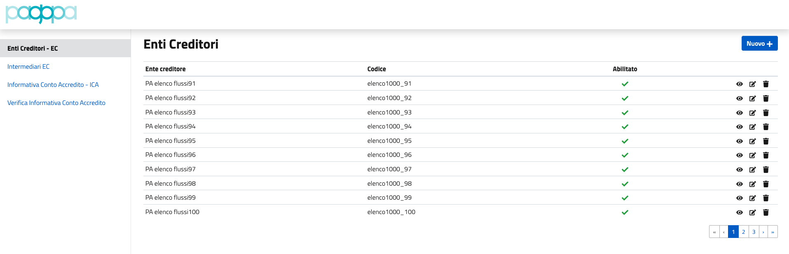

# API Config

The project is useful to create and verify some configuration for the pagoPA platform.

## Prerequisites

- Install [yarn](https://classic.yarnpkg.com/en/docs/getting-started)
- Install lib dependencies

## Available Scripts

In the project directory, you can run:

### `yarn generate`

It generates the client API scripts able to interact with the backend APIs according to its Swagger.\
See [here](https://github.com/pagopa/pagopa-api-config/blob/main/openapi/swagger.json) for more details about.

- On MacOSX use `macosx:generate:api` script. 

### `yarn test`

Launches the test created using [Jest](https://jestjs.io/).

### `yarn build`

Builds the app for production to the `build` folder.\
It correctly bundles React in production mode and optimizes the build for the best performance.

The build is minified and the filenames include the hashes.\

### `yarn start`

Runs the app in the development mode.\
Open [http://localhost:3000](http://localhost:3000) to view it in the browser.\
It should be something like the following image

The page will reload if you make edits and you will also see any lint errors in the console.

